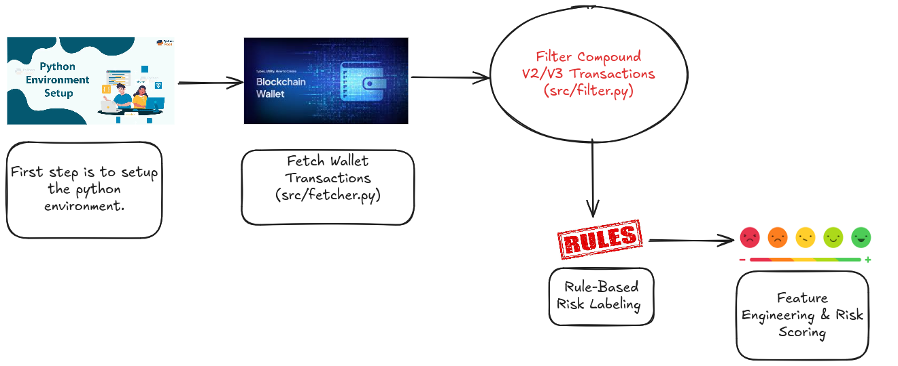

# Wallet risk Scoring from scratch

This project builds upon a previous wallet risk scoring system based on the Random Forest algorithm. The goal here is to assign a risk score to Ethereum wallets provided in the file Wallet_id_Sheet1.csv. The scoring focuses specifically on wallets' activities within the Compound V2/V3 protocol, using a rule-based approach to flag risky behavior and generate a risk score between 0 to 1000.

## Steps/Architecture

### Steps 
1. Python Environment Setup

    - Create and activate a dedicated Python virtual environment to avoid any version conflicts.

    - Install all required dependencies using requirements.txt or pip.

2. Fetch Wallet Transactions

    - Use the Etherscan API to fetch the complete transaction history of each wallet listed in `Wallet_id_Sheet1.csv`.

    - Store the combined transaction data for all wallets in a CSV file named `all_wallets_raw_eth_transactions.csv`.

    **Note**: There are a total of 6420 transactions across 103 wallets.

    **This logic is implemented in the script: `src/fetcher.py`.**

3. Filter **Compound V2/V3 Transactions**

    - From the raw transactions CSV file `all_wallets_raw_eth_transactions.csv`, filter only those transactions which interact with Compound V2 or V3 protocol smart contract addresses.

    - The filtered Compound protocol transactions are saved as `src/compound_v2_v3_transactions.csv`.

    - This filtering is implemented in `src/filter.py`.

4. Rule-Based Risk Labeling

    Using domain-specific rules inspired by relevant whitepapers, classify wallets as risky or safe based on protocol behavior:

    - A wallet with at least one liquidation event (action "liquidationcall") is always risky.

    - Wallets that never borrowed are considered safe.

    - Wallets that borrowed but never repaid are considered risky.

    - Wallets that repaid less than 40% of their borrowed amount (in USD equivalent) are considered risky.

    - Wallets showing more than 20 ‘burst’ actions (i.e., rapid consecutive transactions) are considered risky.

    - Wallets that perform aggressive borrow and redeem actions in quick succession are deemed risky.

    - All other wallets are considered safe.

5. Feature Engineering & Risk Scoring

    - Extract meaningful features (like deposit count, borrow count, repayment amount, liquidation count, transaction bursts, time gaps, failed transactions count, etc.) from the Compound transactions per wallet.

    - Apply the above rules to create an initial binary risk label (`is_risky`: `1` for risky, `0`for safe).

    - Calculate a numeric risk score in the range [1000] using weighted, normalized features with custom weights for positive (risk increasing) and negative (risk reducing) factors. Weights and normalization ensure scores have good visual spread.

6. Output

    - Final feature set along with risk labels and scores are saved in `full_features_with_risk_score.csv`.

    - Scores and labels can be used downstream for visualization, decision making, or training ML models in the future.

## Notes and Deliverables 

### Data Collection Method

The data was collected using the Etherscan API to fetch the complete transaction history for each wallet listed in `Wallet_id_Sheet1.csv`. For every wallet, all Ethereum mainnet transactions (including contract interactions, token transfers, etc.) were retrieved and consolidated into a single CSV file (`all_wallets_raw_eth_transactions.csv`). Afterwards, transactions relevant to the Compound protocol **(V2/V3)** were filtered based on official Compound contract addresses, ensuring only protocol-specific actions were analyzed.

### Feature Selection Rationale

Feature selection focused on capturing behaviors and patterns that directly reflect a wallet’s risk profile within the Compound protocol. Chosen features included:

- **Action Counts**: Number of deposits, borrows, repayments, redemptions, and liquidations by each wallet.

- **Financial Flows**: Total ETH value supplied, borrowed, repaid, and redeemed.

- **Performance Metrics**: Number of failed transactions and total transactions.

- **Behavioral Timing**: Average and minimum time gaps between actions, and **“burst”** activity count (rapid consecutive transactions).

- **Recency**: Days since last activity.

These features were selected because they are directly linked to lending/borrowing risk, user intent, protocol abuse (e.g., bursts), and unusual account management.

### Scoring Method

A rule-based risk label (`is_risky`) was assigned per wallet according to several protocol-focused rules **(e.g., any liquidation event = “risk”, borrow without repayment = “risk”, repaid less than 40% = “risk”, >20 bursts = “risk”)**.

For the numeric risk score (0–1000 scale):

- Each risk-relevant feature (borrow count, liquidation count, failed transactions, burst count, etc.) was normalized and assigned a custom weight reflecting its risk contribution.

- Positive indicators (e.g., more borrowings, liquidations) increased the risk score, while negative indicators (e.g., high repayments, active history) reduced it.

 - Weighted sums were normalized and scaled so even “low-risk” wallets received a minimum moderate score (e.g., 200+), clearly spreading risk across all wallets.

 - The final score offers continuous granularity for ranking and comparing wallets beyond a binary safe/risky label.

### Justification of Risk Indicators Used

- **Liquidation Event**: Clear evidence of risky borrowing or poor collateral management—industry-standard marker of default risk.

 - **No Borrowing**: Implies passive or safe user, so always “safe.”

- **Borrow Without Repayment / Low Repayment**: Strong risk that loan will default or only partial repayment done.

- **Burst Activity**: Multiple rapid actions can indicate bot-like or exploitative behavior, which is riskier than organic activity.

- **Aggressive Borrow/Redeem**: Indicates possible manipulation or poor financial planning.

- **Failed Transactions**: High failure rates can show improper/experimental or potentially malicious attempts.
